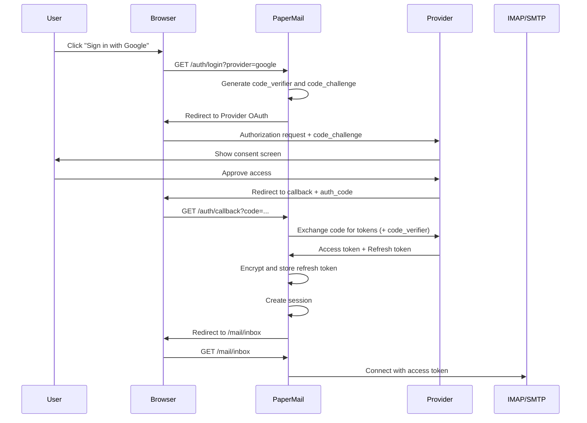

# Authentication & Security

## Overview

PaperMail implements OAuth 2.0 as the primary authentication method, with support for manual IMAP/SMTP configuration as a fallback. Security is prioritized throughout the application.

## OAuth 2.0 Authentication

### Why OAuth?

**Benefits**:

- **No Password Storage**: Application never handles user passwords
- **Limited Scope**: Request only necessary permissions (mail access)
- **Revocable**: Users can revoke access at any time
- **Secure**: Industry-standard protocol with proven security
- **Token Refresh**: Long-lived refresh tokens, short-lived access tokens
- **Provider Trust**: Leverages existing provider security

**Challenges**:

- Complex initial setup
- Provider-specific implementations
- Token management and refresh
- Redirect flow on E-Ink devices (slow)

### Current Implementation Status

The application currently implements **OpenID Connect authentication with Azure AD** (Microsoft Entra ID).

**Authentication Endpoint**: Uses Azure AD B2C or Entra ID endpoints

**Required Scopes**:
- `openid` - Basic OpenID Connect authentication
- `profile` - User profile information
- `email` - Email address
- `offline_access` - Refresh token support

**Implementation**: See `AuthController.cs` and `IServiceCollectionExtensions.cs`

## OAuth Flow Implementation

### Authorization Code Flow with PKCE



### Step-by-Step Implementation

#### 1. User Initiates Login

```csharp
// Pages/Auth/Login.cshtml.cs
public class LoginModel : PageModel
{
    private readonly IOAuthService _oAuthService;
    
    public IActionResult OnGetAsync(string provider)
    {
        // Generate PKCE parameters
        var (codeVerifier, codeChallenge) = _oAuthService.GeneratePkceParameters();
        
        // Store code_verifier in session
        HttpContext.Session.SetString("code_verifier", codeVerifier);
        
        // Build authorization URL
        var authUrl = _oAuthService.GetAuthorizationUrl(provider, codeChallenge);
        
        // Redirect to provider
        return Redirect(authUrl);
    }
}
```

#### 2. Provider Redirects Back

```csharp
// Pages/Auth/OAuth.cshtml.cs
public class OAuthModel : PageModel
{
    private readonly IOAuthService _oAuthService;
    private readonly ITokenStorage _tokenStorage;
    
    public async Task<IActionResult> OnGetAsync(string code, string state, string error)
    {
        if (!string.IsNullOrEmpty(error))
        {
            return RedirectToPage("/Error", new { message = error });
        }
        
        // Retrieve code_verifier from session
        var codeVerifier = HttpContext.Session.GetString("code_verifier");
        
        // Exchange authorization code for tokens
        var tokens = await _oAuthService.ExchangeCodeForTokensAsync(
            code, 
            codeVerifier
        );
        
        // Encrypt and store refresh token
        await _tokenStorage.StoreTokenAsync(
            User.Identity.Name,
            tokens.RefreshToken
        );
        
        // Store access token in session (temporary)
        HttpContext.Session.SetString("access_token", tokens.AccessToken);
        HttpContext.Session.SetInt32("token_expiry", tokens.ExpiresIn);
        
        return RedirectToPage("/Mail/Inbox");
    }
}
```

#### 3. Token Refresh

```csharp
// Infrastructure/Authentication/OAuthService.cs
public class OAuthService : IOAuthService
{
    public async Task<string> GetValidAccessTokenAsync(string userId)
    {
        // Check session for existing valid token
        var accessToken = _session.GetString("access_token");
        var expiry = _session.GetInt32("token_expiry");
        
        if (!string.IsNullOrEmpty(accessToken) && !IsExpired(expiry))
        {
            return accessToken;
        }
        
        // Token expired, refresh it
        var refreshToken = await _tokenStorage.GetTokenAsync(userId);
        var newTokens = await RefreshAccessTokenAsync(refreshToken);
        
        // Update session
        _session.SetString("access_token", newTokens.AccessToken);
        _session.SetInt32("token_expiry", newTokens.ExpiresIn);
        
        return newTokens.AccessToken;
    }
    
    private async Task<TokenResponse> RefreshAccessTokenAsync(string refreshToken)
    {
        var request = new TokenRefreshRequest
        {
            RefreshToken = refreshToken,
            ClientId = _configuration["OAuth:ClientId"],
            ClientSecret = _configuration["OAuth:ClientSecret"]
        };
        
        var response = await _httpClient.PostAsync(
            _provider.TokenEndpoint,
            new FormUrlEncodedContent(request.ToFormData())
        );
        
        return await response.Content.ReadFromJsonAsync<TokenResponse>();
    }
}
```

## Token Storage & Security

### Secure Token Storage

```csharp
// Infrastructure/Authentication/TokenStorage.cs
public class TokenStorage : ITokenStorage
{
    private readonly IDataProtectionProvider _dataProtection;
    private readonly IDistributedCache _cache;
    
    public async Task StoreTokenAsync(string userId, string refreshToken)
    {
        // Encrypt refresh token
        var protector = _dataProtection.CreateProtector("RefreshTokens");
        var encryptedToken = protector.Protect(refreshToken);
        
        // Store in distributed cache (or database)
        await _cache.SetStringAsync(
            $"token:{userId}",
            encryptedToken,
            new DistributedCacheEntryOptions
            {
                // Refresh tokens typically valid for months
                AbsoluteExpirationRelativeToNow = TimeSpan.FromDays(90)
            }
        );
    }
    
    public async Task<string> GetTokenAsync(string userId)
    {
        var encryptedToken = await _cache.GetStringAsync($"token:{userId}");
        
        if (string.IsNullOrEmpty(encryptedToken))
        {
            throw new AuthenticationException("No token found");
        }
        
        // Decrypt refresh token
        var protector = _dataProtection.CreateProtector("RefreshTokens");
        return protector.Unprotect(encryptedToken);
    }
    
    public async Task RevokeTokenAsync(string userId)
    {
        await _cache.RemoveAsync($"token:{userId}");
    }
}
```

### Token Encryption

**Method**: ASP.NET Core Data Protection API

**Key Management**:

- Keys stored in file system or Azure Key Vault
- Automatic key rotation
- Machine-specific encryption

**Encryption Algorithm**: AES-256-CBC with HMAC-SHA256

## Manual IMAP/SMTP Configuration

For providers without OAuth support or user preference:

### Configuration Model

```csharp
public class ManualEmailConfiguration
{
    public string EmailAddress { get; set; }
    
    // IMAP Settings
    public string ImapServer { get; set; }
    public int ImapPort { get; set; } = 993;
    public bool ImapUseSsl { get; set; } = true;
    
    // SMTP Settings
    public string SmtpServer { get; set; }
    public int SmtpPort { get; set; } = 587;
    public bool SmtpUseTls { get; set; } = true;
    
    // Credentials
    public string Username { get; set; }
    public string Password { get; set; } // Encrypted
}
```

### Password Storage

```csharp
public class ManualAuthService : IManualAuthService
{
    private readonly IDataProtectionProvider _dataProtection;
    
    public async Task StoreCredentialsAsync(string userId, ManualEmailConfiguration config)
    {
        // Encrypt password before storage
        var protector = _dataProtection.CreateProtector("Passwords");
        config.Password = protector.Protect(config.Password);
        
        // Store configuration (in cache or database)
        await _cache.SetStringAsync(
            $"manual_config:{userId}",
            JsonSerializer.Serialize(config)
        );
    }
}
```

## IMAP/SMTP Authentication

### Using OAuth Tokens

```csharp
// Infrastructure/Email/ImapEmailRepository.cs
public class ImapEmailRepository : IEmailRepository
{
    private readonly IOAuthService _oAuthService;
    
    public async Task<IEnumerable<Email>> GetEmailsAsync(string userId)
    {
        using var client = new ImapClient();
        
        // Connect
        await client.ConnectAsync("imap.gmail.com", 993, true);
        
        // Authenticate with OAuth
        var accessToken = await _oAuthService.GetValidAccessTokenAsync(userId);
        var oauth2 = new SaslMechanismOAuth2(userId, accessToken);
        await client.AuthenticateAsync(oauth2);
        
        // Use IMAP client...
        var inbox = client.Inbox;
        await inbox.OpenAsync(FolderAccess.ReadOnly);
        
        // Fetch emails...
    }
}
```

### Using Manual Credentials

```csharp
public async Task<IEnumerable<Email>> GetEmailsAsync(string userId)
{
    using var client = new ImapClient();
    
    var config = await _manualAuthService.GetConfigurationAsync(userId);
    
    // Connect
    await client.ConnectAsync(config.ImapServer, config.ImapPort, config.ImapUseSsl);
    
    // Authenticate with username/password
    await client.AuthenticateAsync(config.Username, config.Password);
    
    // Use IMAP client...
}
```

## Session Management

### Session Configuration

```csharp
// Program.cs
builder.Services.AddSession(options =>
{
    options.IdleTimeout = TimeSpan.FromMinutes(60);
    options.Cookie.HttpOnly = true;
    options.Cookie.IsEssential = true;
    options.Cookie.SecurePolicy = CookieSecurePolicy.Always;
    options.Cookie.SameSite = SameSiteMode.Strict;
});
```

### Session Data

**Stored in Session**:

- User ID
- Current access token (encrypted)
- Token expiry time
- Provider type
- Current folder
- Display preferences

**NOT Stored in Session**:

- Refresh tokens (stored encrypted in cache/database)
- Passwords
- Email content

## Security Headers

### Content Security Policy (CSP)

```csharp
// Middleware/SecurityHeadersMiddleware.cs
public class SecurityHeadersMiddleware
{
    public async Task InvokeAsync(HttpContext context, RequestDelegate next)
    {
        // Content Security Policy
        context.Response.Headers.Add(
            "Content-Security-Policy",
            "default-src 'self'; " +
            "script-src 'self' 'unsafe-inline'; " + // Alpine.js requires inline
            "style-src 'self' 'unsafe-inline'; " +  // TailwindCSS requires inline
            "img-src 'self' data:; " +
            "font-src 'self'; " +
            "connect-src 'self'; " +
            "frame-ancestors 'none';"
        );
        
        // Other security headers
        context.Response.Headers.Add("X-Frame-Options", "DENY");
        context.Response.Headers.Add("X-Content-Type-Options", "nosniff");
        context.Response.Headers.Add("Referrer-Policy", "strict-origin-when-cross-origin");
        context.Response.Headers.Add("Permissions-Policy", "geolocation=(), microphone=(), camera=()");
        
        // HSTS
        context.Response.Headers.Add(
            "Strict-Transport-Security",
            "max-age=31536000; includeSubDomains"
        );
        
        await next(context);
    }
}
```

## HTML Sanitization

### Email Content Sanitization

```csharp
// Infrastructure/Security/HtmlSanitizer.cs
public class EmailHtmlSanitizer : IHtmlSanitizer
{
    public string Sanitize(string html)
    {
        var sanitizer = new HtmlSanitizer();
        
        // Allow safe tags
        sanitizer.AllowedTags.Clear();
        sanitizer.AllowedTags.Add("p");
        sanitizer.AllowedTags.Add("br");
        sanitizer.AllowedTags.Add("strong");
        sanitizer.AllowedTags.Add("em");
        sanitizer.AllowedTags.Add("u");
        sanitizer.AllowedTags.Add("a");
        sanitizer.AllowedTags.Add("ul");
        sanitizer.AllowedTags.Add("ol");
        sanitizer.AllowedTags.Add("li");
        sanitizer.AllowedTags.Add("blockquote");
        
        // Allow safe attributes
        sanitizer.AllowedAttributes.Clear();
        sanitizer.AllowedAttributes.Add("href");
        
        // Remove all CSS
        sanitizer.AllowedCssProperties.Clear();
        
        // Remove scripts
        sanitizer.AllowedSchemes.Clear();
        sanitizer.AllowedSchemes.Add("http");
        sanitizer.AllowedSchemes.Add("https");
        sanitizer.AllowedSchemes.Add("mailto");
        
        return sanitizer.Sanitize(html);
    }
}
```

## CSRF Protection

### Anti-Forgery Tokens

```html
<!-- Pages/Mail/Compose.cshtml -->
<form method="post">
    @Html.AntiForgeryToken()
    
    <!-- Form fields -->
</form>
```

```csharp
// Pages/Mail/Compose.cshtml.cs
[ValidateAntiForgeryToken]
public async Task<IActionResult> OnPostAsync(ComposeModel model)
{
    // Handle form submission
}
```

## Security Checklist

- [x] OAuth 2.0 with PKCE
- [x] Refresh token encryption
- [x] Access token short-lived (1 hour)
- [x] Secure session management
- [x] HTTPS enforcement
- [x] Content Security Policy
- [x] HTML sanitization
- [x] CSRF protection
- [x] XSS prevention
- [x] Secure headers
- [x] Password encryption (manual auth)
- [x] Token revocation support

## Error Handling

### Authentication Errors

```csharp
public class AuthenticationException : Exception
{
    public AuthErrorType ErrorType { get; set; }
    
    public enum AuthErrorType
    {
        InvalidCredentials,
        TokenExpired,
        TokenRevoked,
        ProviderError,
        NetworkError
    }
}
```

### User-Friendly Messages

- **Invalid Credentials**: "Unable to sign in. Please check your credentials."
- **Token Expired**: "Session expired. Please sign in again."
- **Provider Error**: "Unable to connect to your email provider. Please try again."

## Privacy Considerations

### Data Minimization

- Only request necessary OAuth scopes
- Don't store email content unnecessarily
- Clear session data on logout
- Provide token revocation

### User Control

- Ability to revoke access
- Delete account functionality
- Export/download data
- View active sessions

## Compliance

### OAuth 2.0 Best Practices

- Use PKCE for authorization code flow
- Short-lived access tokens
- Secure refresh token storage
- Proper redirect URI validation
- State parameter for CSRF protection

### Security Standards

- OWASP Top 10 mitigation
- HTTPS/TLS 1.2+
- Secure password storage (if manual auth)
- Regular security audits

## Future Enhancements

- [ ] Multi-factor authentication support
- [ ] OAuth provider discovery
- [ ] Additional providers (ProtonMail, FastMail)
- [ ] WebAuthn/FIDO2 support
- [ ] Device fingerprinting
- [ ] Suspicious activity alerts
